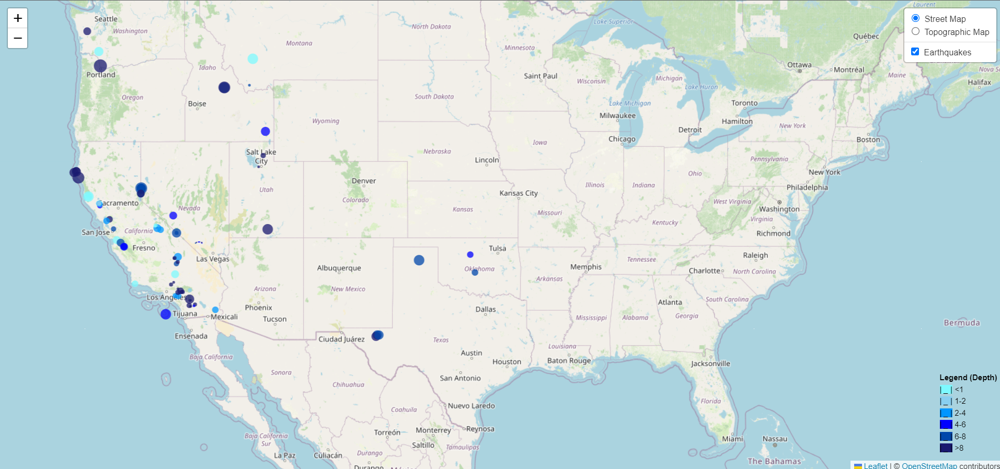

# leaflet-challenge
Module 15 Challenge for the Vanderbilt Data Analytics Bootcamp 2023

# Code from Other Sources
[Demonstration of pointToLayer](https://geospatialresponse.wordpress.com/2015/07/26/leaflet-geojson-pointtolayer/)

Shades of blue were taken from [this page](https://htmlcolorcodes.com/colors/shades-of-blue/). 

Legend adapted from [page1](https://gis.stackexchange.com/questions/133630/adding-leaflet-legend), [page2](https://codepen.io/haakseth/pen/KQbjdO), and [page3](https://developer.mozilla.org/en-US/docs/Web/API/Element/innerHTML). 

# Earthquake Map
